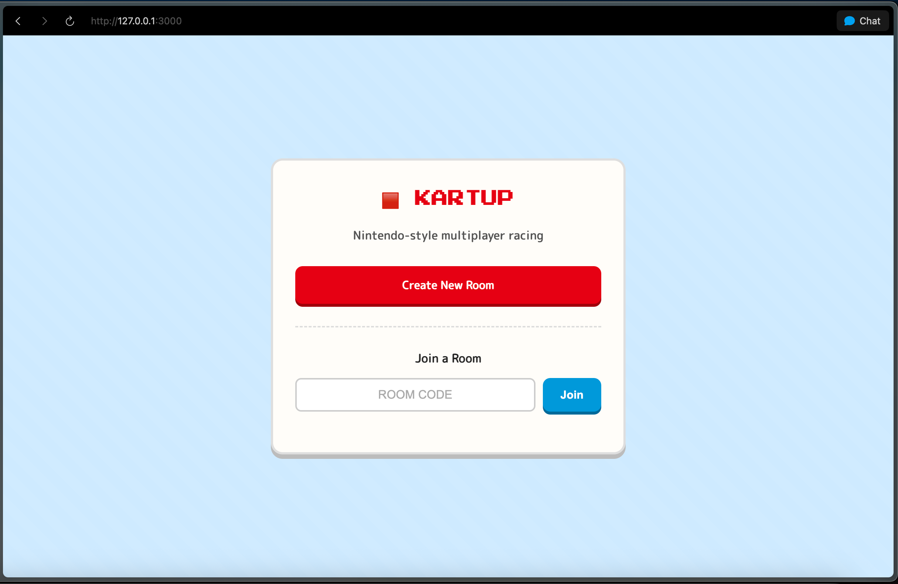
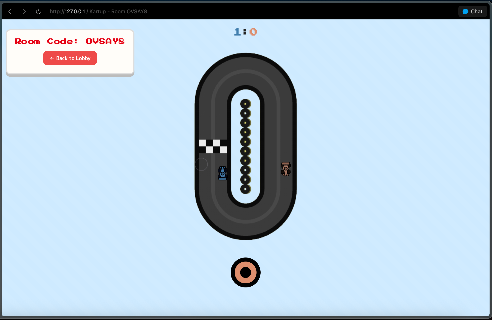

# 🏎️ Kartup

A real-time multiplayer racing game built with Node.js and Socket.io. Race against your friends in Nintendo-style kart racing action!

## 🎮 What is Kartup?

Kartup is a browser-based multiplayer racing game where two players can compete in real-time. Create a room, share the code with a friend, and race to see who can complete the most laps first!

## ✨ Features

- **Real-time Multiplayer**: Race against friends in real-time using WebSockets
- **Room-based Gaming**: Create private rooms with shareable 6-character codes
- **Nintendo-style Design**: Retro gaming aesthetic with pixel-perfect styling
- **Responsive Controls**: Smooth car movement and rotation
- **Score Tracking**: First to 3 laps wins takes the victory
- **Auto Cleanup**: Empty rooms are automatically cleaned up
- **Mobile Friendly**: Works on both desktop and mobile devices

## 🚀 How to Run

### Prerequisites
- Node.js (version 14 or higher)
- npm

### Installation

1. **Clone the repository**
   ```bash
   git clone https://github.com/Shaileshsaravanan/kartup.git
   cd kartup
   ```

2. **Install dependencies**
   ```bash
   npm install
   ```

3. **Start the server**
   ```bash
   npm start
   ```
   
   Or for development with auto-restart:
   ```bash
   npm run dev
   ```

4. **Open your browser**
   - Go to `http://localhost:3000`
   - The game will be running on port 3000 (or whatever port you set in environment variables)

## 🎯 How to Play

1. **Create a Room**: Click "Create New Room" on the lobby page
2. **Share the Code**: Give the 6-character room code to your friend
3. **Join the Race**: Your friend enters the code and clicks "Join"
4. **Start Racing**: Both players click "Ready" to begin
5. **Race to Win**: Complete laps around the track - first to 3 wins!

### Controls
- **Mouse/Touch**: Hold down to accelerate and steer your kart
- The longer you hold, the faster you go (up to max speed)
- Release to slow down and coast

## 🛠️ Tech Stack

- **Backend**: Node.js, Express.js
- **Real-time Communication**: Socket.io
- **Frontend**: Vanilla JavaScript, Pug templates
- **Styling**: CSS3 with custom Nintendo-style design

## 🎨 Screenshots

*Game lobby where players create or join rooms*


*Racing action with two players*


## 🌐 Live Demo

Try it out: [kartup.onrender.com](https://kartup.onrender.com)